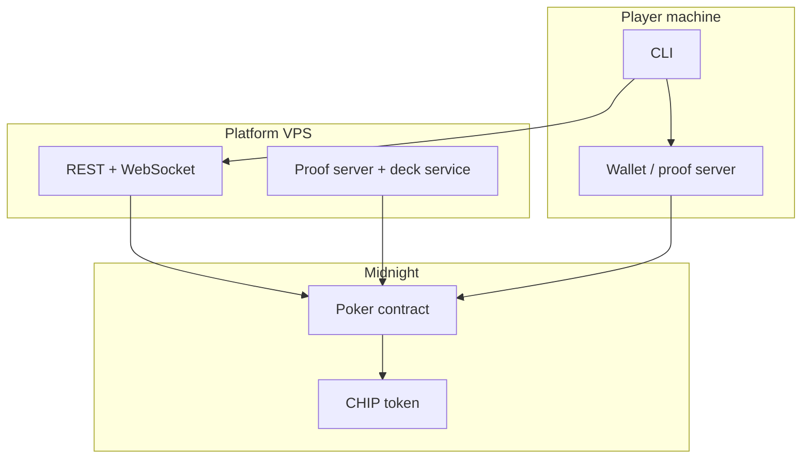

# Midnight Poker — Product Requirements Document (PRD)

**Version:** 0.1 (design)  
**Status:** Specification; implementation not started in this repo  
**Network:** Midnight (testnet → mainnet)

---

## 1. Summary

Midnight Poker is a **CLI-first Texas Hold'em** platform on Midnight. A single on-chain contract hosts multiple tables. Each hand uses a **Merkle-committed deck** and **ZK shuffle proof** so the platform cannot change cards mid-hand; players verify fairness after the session.

**Payments** (wallet funding, table buy-in, cash-out) and **betting** (in-hand actions and pot logic) are separate product areas with their own specs — see [Documentation](#10-documentation).

---

## 2. Problem

Players want provably fair online poker without trusting a centralized server for card dealing. Builders need a clear product and technical spec before implementing the Compact contract, proofs, and CLI.

---

## 3. Goals

| Goal | Description |
|------|-------------|
| **Fair dealing** | Deck committed on-chain per hand; reveals verified against Merkle root |
| **Private hole cards** | Encrypted to player keys; decrypted locally via wallet / proof server |
| **Multi-table scale** | One contract, many concurrent games (`game_id`) |
| **Clear money boundaries** | CHIP payments and table escrow documented apart from betting rules |
| **Verifiable sessions** | Post-game, anyone can replay hands and check payouts |

---

## 4. Non-goals (v1)

- Web or mobile UI (CLI only)
- Player-minted CHIP or on-chain fiat rails
- Cash games with unlimited rebuy mid-hand
- Blinds (product uses **ante** only)
- More than 6 seats per table

---

## 5. Users

| Persona | Needs |
|---------|--------|
| **Player** | Join tables, act on turn, see own cards, cash out when done |
| **Platform operator** | Create games, shuffle/deal, reveal community cards, run API + proof server |
| **Auditor / researcher** | Replay completed games from on-chain reveals and proofs |

---

## 6. Core product requirements

### 6.1 Game

| ID | Requirement |
|----|-------------|
| G-1 | Texas Hold'em, 2–6 players per table |
| G-2 | Fixed session length: `max_hands` per game |
| G-3 | Auto-start hand when ≥ 2 players seated and platform starts deal |
| G-4 | Standard streets: preflop → flop → turn → river → showdown |
| G-5 | Actions: check, call, raise, fold, all-in |
| G-6 | Winner-takes-all pot; split on tied hands |
| G-7 | Disconnect: auto-fold after block-based timeout |

### 6.2 Deck & trust

| ID | Requirement |
|----|-------------|
| D-1 | 52-card deck as Merkle tree (Poseidon leaves) |
| D-2 | Platform submits shuffle ZK proof + root each hand |
| D-3 | Community cards revealed per street with Merkle proofs |
| D-4 | End-of-game: full deck reveal for independent replay |

### 6.3 Payments *(detailed spec: [`docs/payments.md`](docs/payments.md))*

| ID | Requirement |
|----|-------------|
| P-1 | CHIP fungible token for all table value |
| P-2 | Off-chain purchase → on-chain CHIP to player wallet |
| P-3 | Buy-in locks CHIP in contract escrow (`joinGame`) |
| P-4 | Cash out when game **SETTLED** (`withdraw`) or between hands (`leaveGame`) |
| P-5 | Per-hand platform fee from player stack |

> Payment flows, escrow, and withdraw rules are **not** defined in this PRD. Use the payments doc only.

### 6.4 Betting *(rules: [`docs/betting.md`](docs/betting.md) · engine: [`docs/betting-algorithm.md`](docs/betting-algorithm.md))*

| ID | Requirement |
|----|-------------|
| B-1 | Equal ante from each seated player at hand start (no blinds) |
| B-2 | Betting only on PREFLOP–RIVER |
| B-3 | Pot settled at showdown or when all but one fold |
| B-4 | Contract enforces turn order and valid actions |

> Street completion, turn rotation, and chip/pot updates are specified in the **betting algorithm** doc, not here.

### 6.5 Client & platform

| ID | Requirement |
|----|-------------|
| C-1 | Player CLI: wallet, join, act, status, withdraw |
| C-2 | Platform: REST for submits, WebSocket for live state |
| C-3 | Platform runs deck generation, encryption, and heavy proving |

---

## 7. User journeys (high level)

### Player — join and play

1. Initialize wallet (Midnight keypair).
2. Obtain CHIP (off-chain with platform) — see [payments doc](docs/payments.md).
3. List tables → join with buy-in within table limits.
4. Play hands until session ends or leave between hands.
5. Withdraw remaining stack — see [payments doc](docs/payments.md).

### Player — in-hand

1. Receive turn notification (WebSocket).
2. Submit action (call, raise, fold, etc.) — see [betting doc](docs/betting.md).
3. See board updates as community cards are revealed.

### Post-game verification

1. All cards and Merkle proofs published.
2. Third party replays hands and checks pot vs. results.

---

## 8. System context

---

## 9. Success criteria (v1 launch)

- [ ] Two+ players complete a full `max_hands` session on testnet
- [ ] Post-game replay matches on-chain payouts
- [ ] Payment doc flows implemented: fund wallet → join → withdraw/leave
- [ ] Betting doc + algorithm doc behavior covered by contract tests
- [ ] No hand starts without valid shuffle proof

---

## 10. Documentation

| Document | Scope |
|----------|--------|
| [`CONTEXT.md`](CONTEXT.md) | Domain glossary |
| [`docs/payments.md`](docs/payments.md) | CHIP, deposit, withdraw, escrow, fees — **standalone** |
| [`docs/betting.md`](docs/betting.md) | Betting **rules** (what players can do) |
| [`docs/betting-algorithm.md`](docs/betting-algorithm.md) | Betting **engine** (turn order, street end, pot math) |
| [`docs/ai-context.md`](docs/ai-context.md) | Contract state, witnesses, implementation notes |
| [`docs/adr/`](docs/adr/) | Architecture decisions |

---

## 11. Roadmap (phases)

| Phase | Deliverable |
|-------|-------------|
| **0** | PRD + domain docs + ADRs *(current)* |
| **1** | CHIP token + payment entrypoints (`joinGame`, `withdraw`, `leaveGame`) |
| **2** | Betting contract + algorithm tests |
| **3** | Deck Merkle + shuffle proof + reveals |
| **4** | CLI + platform API on testnet |

---

## 12. Open questions

- Side-pot edge cases when three+ players go all-in for different amounts (algorithm doc drafts behavior; needs test vectors).
- Minimum stack when player cannot cover ante mid-session (bust vs. block hand).
- Exact timeout duration in blocks.

---

## Related

- Glossary: [`CONTEXT.md`](CONTEXT.md)
- Agents / triage: [`AGENTS.md`](AGENTS.md)
