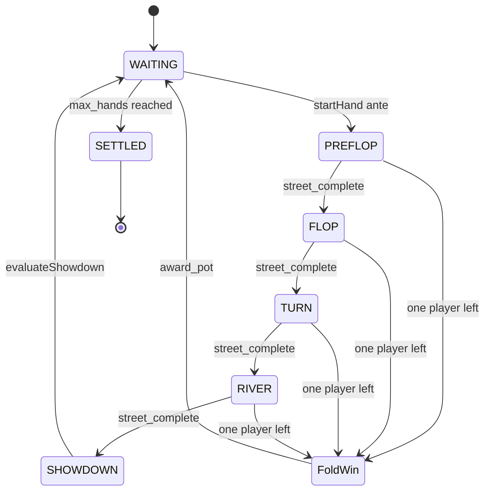

# Betting algorithm — engine specification

Technical specification for **how the contract advances betting**: state fields, turn order, street completion, chip movements between `chip_balance`, `hand_commitment`, and `pot`, fold-wins, and showdown distribution.

**Player-facing rules** (what is allowed): [`betting.md`](betting.md)  
**Wallet and escrow** (no betting): [`payments.md`](payments.md)

---

## 1. State (betting engine)

### 1.1 Per game

| Field | Type | Role |
|-------|------|------|
| `phase` | enum | Must be PREFLOP–RIVER for `act` |
| `pot` | Uint<64> | Total chips in current hand pot |
| `current_player_index` | seat 0–5 | Whose turn to act |
| `last_raiser_index` | seat 0–5 | Last seat that raised this street |
| `ante` | Uint<64> | Posted at `startHand` |

### 1.2 Per seat (player)

| Field | Role |
|-------|------|
| `chip_balance` | Stack not yet committed this hand |
| `hand_commitment` | Chips put in this hand (ante + bets) |
| `folded` | If true, skip in turn order |
| `last_action` | Last action enum (audit / UI) |

### 1.3 Derived per street

| Derived | Definition |
|---------|------------|
| `current_bet` | max(`hand_commitment`) over non-folded seats |
| `to_call(seat)` | `current_bet - hand_commitment[seat]` |

---

## 2. Hand initialization (`startHand`)

**Preconditions:** `phase == WAITING`, ≥ 2 occupied seats.

```
for each occupied seat i:
  assert chip_balance[i] >= ante
  chip_balance[i] -= ante
  hand_commitment[i] += ante
  pot += ante
  folded[i] = false
  hand_commitment[i] reset contextually if new hand (only ante so far)

phase = PREFLOP
current_player_index = first_active_seat_after_dealer()  // implementation: seat 0 UTG per ai-context
last_raiser_index = none OR current_player_index  // define at implement: no raise yet
reset street action flags
```

---

## 3. Chip transfer primitive

All betting uses one internal operation:

```
commit_chips(seat, amount):
  amount = min(amount, chip_balance[seat])
  chip_balance[seat] -= amount
  hand_commitment[seat] += amount
  pot += amount
  return amount  // actual committed (for all-in partial)
```

**Invariant:** `pot` increases by exactly the sum of all `commit_chips` calls in the hand (until payout clears pot).

---

## 4. Action handlers (`act`)

Let `seat = current_player_index`, `tc = to_call(seat)`.

### 4.1 Check

```
require tc == 0
advance_turn()
```

### 4.2 Call

```
require tc > 0
commit_chips(seat, tc)
advance_turn()
```

### 4.3 Raise(raise_amount)

Interpretation: **total** new commitment above current level, or **increment** — implementation must fix one convention. Recommended: `raise_amount` = **additional chips beyond call**.

```
commit_chips(seat, tc)                    // call first
commit_chips(seat, raise_amount)          // raise portion
last_raiser_index = seat
mark_action_required_for_other_seats()      // see §5
advance_turn()
```

Minimum raise rules (if product adds min-raise): enforce `raise_amount >= min_raise` before commit.

### 4.4 Fold

```
folded[seat] = true
advance_turn()
```

### 4.5 All-in

```
commit_chips(seat, chip_balance[seat])      // entire stack
if hand_commitment[seat] > current_bet:
  last_raiser_index = seat
advance_turn()
```

---

## 5. Turn order (`advance_turn`)

```
function advance_turn():
  repeat:
    current_player_index = next_seat_circular(current_player_index)
  until seat is occupied and not folded

  if street_complete():
    end_street()
  else if only_one_player_not_folded():
    award_pot_to_last_player()
  else:
    set timeout_block = now + TIMEOUT
```

`next_seat_circular`: index = (index + 1) % 6, skip null seats.

---

## 6. Street completion (`street_complete`)

Betting on the current street ends when **both** hold:

1. **Matched commitments:** For every seat `i` with `!folded[i]` and `chip_balance[i] > 0 OR all_in[i]`:
   - `hand_commitment[i] == current_bet` **OR** player is all-in for less than `current_bet` (short stack).
2. **Action closure:** Turn has returned to `last_raiser_index` and that player has acted since the last raise, **or** no raise occurred and every active player has acted once since street start.

Pseudocode:

```
street_complete():
  active = seats where !folded
  if |active| <= 1: return true

  for i in active:
    if not all_in[i] and hand_commitment[i] < current_bet:
      return false

  if no_raise_this_street:
    return action_count_since_street_start >= |active|

  return current_player_index == last_raiser_index
      and acted_since_raise[last_raiser_index]
```

On `street_complete()` → `end_street()`:

| Current phase | Next |
|---------------|------|
| PREFLOP | FLOP (+ reveal 3 cards) |
| FLOP | TURN (+ 1 card) |
| TURN | RIVER (+ 1 card) |
| RIVER | SHOWDOWN |

Reset per-street: `last_raiser_index`, action counters; **do not** reset `hand_commitment` (bets carry across streets within the same hand).

---

## 7. Fold win (no showdown)

```
function only_one_player_not_folded():
  return count(!folded) == 1

function award_pot_to_last_player():
  winner = sole seat with !folded
  chip_balance[winner] += pot
  pot = 0
  clear_hand_commitments_for_all_seats()
  end_hand_settlement()    // fees, hand_number, phase — see §9
```

---

## 8. Side pots (multiple all-ins)

When players are all-in for different amounts, split **`pot`** into layers:

```
1. Sort non-folded seats by hand_commitment ascending.
2. For each distinct commitment level L (except duplicates):
   - Layer pot = (L - prev_L) * (number of players who committed >= L)
   - Eligible winners for layer = players who contributed >= L and not folded at showdown
3. At showdown, award each layer to best hand among eligible only.
```

**Folded players** forfeit eligibility but their committed chips remain in the layers they helped build.

Implementers should ship test vectors for 2- and 3-way all-in with different stack sizes.

---

## 9. Showdown payout (`evaluateShowdown`)

**Preconditions:** `phase == SHOWDOWN` (or entered from RIVER complete).

```
1. Verify hole card reveals vs. deck_root (Merkle).
2. winners = verify_hand(community, holes)  // witness; may be multiple
3. If single main pot and no side pots:
     distribute pot to winners (equal split)
4. Else:
     run side-pot distribution (§8) per layer
5. pot = 0
6. clear hand_commitments
7. end_hand_settlement()
```

```
function end_hand_settlement():
  for each occupied seat:
    chip_balance[i] -= per_hand_fee   // payments policy
  hand_number += 1
  if hand_number == max_hands:
    phase = SETTLED
  else:
    phase = WAITING
```

---

## 10. End-to-end algorithm flow



---

## 11. Invariants (must hold after every `act`)

| ID | Invariant |
|----|-----------|
| INV-1 | `pot >= 0`, `chip_balance[i] >= 0` |
| INV-2 | No wallet transfer during `act` |
| INV-3 | Folded seats never receive `current_player_index` |
| INV-4 | Sum of `(hand_commitment[i] - ante_portion_i)` contributions reconciles with pot before payout |
| INV-5 | After payout, `pot == 0` and `hand_commitment[*] == 0` |

---

## 12. Implementer checklist (algorithm)

- [ ] `startHand` ante loop with stack checks
- [ ] `to_call` and `current_bet` derived correctly
- [ ] Street completion matches §6 (unit tests per street)
- [ ] All-in short stack does not block street incorrectly
- [ ] Side-pot tests (2–3 players)
- [ ] Fold win path clears pot once
- [ ] `foldInactive` sets `folded` and calls same advance logic

---

## Related

- Rules: [`betting.md`](betting.md)
- Payments: [`payments.md`](payments.md)
- Contract fields: [`ai-context.md`](ai-context.md)
