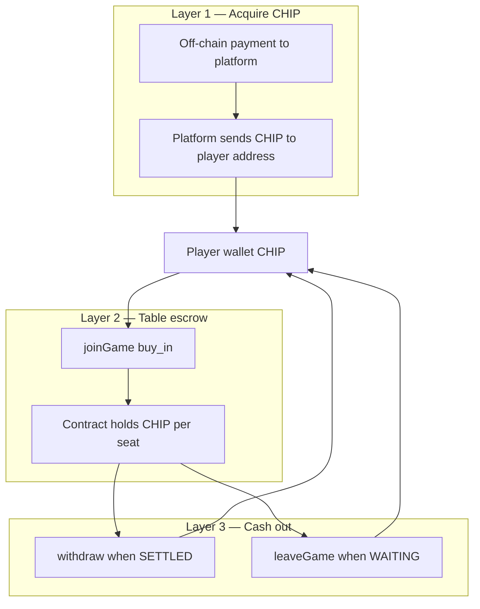

# Payments — CHIP, deposit, and withdraw

Standalone specification for **all payment and escrow behavior** in Midnight Poker. This document does not define betting streets, actions, or pot algorithms — see [`betting.md`](betting.md) and [`betting-algorithm.md`](betting-algorithm.md).

Terms align with [`CONTEXT.md`](../CONTEXT.md).

---

## 1. Scope

| In scope | Out of scope |
|----------|----------------|
| CHIP token model | Check / call / raise logic |
| Wallet funding (off-chain → on-chain) | Ante and pot distribution math |
| Table buy-in (`joinGame`) | Hand evaluation |
| Cash-out (`withdraw`, `leaveGame`) | Merkle deck proofs |
| Contract escrow | Turn order |

---

## 2. CHIP token

| Property | Value |
|----------|--------|
| Name | Poker Chip |
| Symbol | CHIP |
| Decimals | 0 (whole chips only) |
| Minting | Platform only |
| Use | Buy-in, fees; table stack accounting uses contract state, not wallet balance |

Players **do not** mint CHIP. The poker contract references `token_id` for transfers in and out of escrow.

---

## 3. Payment surfaces

Three independent layers:



---

## 4. Layer 1 — Fund wallet (not a poker contract call)

**Purpose:** Player holds CHIP in their Midnight wallet before joining a table.

**Flow:**

1. Player pays platform off-chain (method chosen by platform).
2. Platform transfers CHIP from treasury to player’s address.

**Requirements:**

| ID | Rule |
|----|------|
| PW-1 | No poker contract involvement |
| PW-2 | `joinGame` fails if wallet CHIP &lt; `buy_in_amount` |
| PW-3 | Platform records off-chain payment for support/compliance (implementation-specific) |

---

## 5. Layer 2 — Table deposit (`joinGame`)

**Purpose:** Move CHIP from wallet into **contract escrow** for one table session.

```
Player → contract: joinGame(game_id, buy_in_amount)
```

| ID | Rule |
|----|------|
| PD-1 | `min_buy_in ≤ buy_in_amount ≤ max_buy_in` (set at `createGame`) |
| PD-2 | Seat: first empty slot in 6-seat array |
| PD-3 | Token transfer: `buy_in_amount` CHIP wallet → contract |
| PD-4 | Seat state: `chip_balance = buy_in_amount`, `hand_commitment = 0` |
| PD-5 | Register `player_to_game[address] = game_id` |
| PD-6 | Buy-in is **once per seat session**; stack persists across hands until leave/withdraw |

**Escrow invariant:** While seated, spendable table chips are `chip_balance` on the seat. Wallet CHIP is untouched until the next `joinGame` on another table.

---

## 6. Platform fee (payment policy)

Configured at game creation: `per_hand_fee`.

| ID | Rule |
|----|------|
| PF-1 | Deducted from each seated player’s `chip_balance` at **end of each hand** (after pot settlement for that hand) |
| PF-2 | Not deducted from pot directly |
| PF-3 | Fee recipient: platform (`owner` address or treasury policy in implementation) |

If `chip_balance < per_hand_fee`, implementation must define bust/zero behavior (see PRD open questions).

---

## 7. Layer 3 — Cash out

### 7.1 Withdraw (session complete)

```
Player → contract: withdraw(game_id)
```

| ID | Rule |
|----|------|
| WO-1 | Allowed only when `phase == SETTLED` |
| WO-2 | Transfer entire seat `chip_balance` to player wallet |
| WO-3 | Clear seat and `player_to_game` entry |
| WO-4 | Does not return chips already lost to pot or paid as fees |

### 7.2 Leave (early exit)

```
Player → contract: leaveGame(game_id)
```

| ID | Rule |
|----|------|
| LE-1 | Allowed only when `phase == WAITING` (between hands) |
| LE-2 | Transfer current `chip_balance` to wallet; free seat |
| LE-3 | Not allowed during an active hand |

---

## 8. State fields (payment-relevant)

Per seat:

| Field | Payment meaning |
|-------|-----------------|
| `chip_balance` | Escrowed stack available for antes, bets, and fees |
| `hand_commitment` | Chips locked in current hand (updated by betting engine; see betting-algorithm doc) |

Contract-wide:

| Field | Meaning |
|-------|---------|
| `token_id` | CHIP token used for transfers |
| `min_buy_in`, `max_buy_in` | Join bounds |

---

## 9. Payment vs. betting boundary

| Event | Module |
|-------|--------|
| Player buys CHIP from platform | **Payments** (Layer 1) |
| `joinGame` | **Payments** (Layer 2) |
| `withdraw` / `leaveGame` | **Payments** (Layer 3) |
| `per_hand_fee` deduction | **Payments** (policy); triggered at hand end by game flow |
| Ante, `act`, pot credit to winner | **Betting** + **Betting algorithm** |

The betting engine **mutates** `chip_balance` and `hand_commitment` during play; it does not move CHIP to/from the player wallet. Only payment entrypoints do wallet ↔ contract transfers.

---

## 10. Examples (payments only)

**Fund wallet:** Alice pays $50 off-chain → platform sends 1000 CHIP to `alice_address`.

**Deposit:** Table limits 100–1000. Alice `joinGame(id, 500)` → wallet −500, contract escrow +500, `chip_balance = 500`.

**Leave:** Mid-tournament Alice has `chip_balance = 380`, phase WAITING → `leaveGame` → wallet +380, seat empty.

**Withdraw:** After hand 50, phase SETTLED, Alice `chip_balance = 620` → `withdraw` → wallet +620.

---

## 11. Implementer checklist (payments)

- [ ] CHIP `token_id` wired at deploy
- [ ] `joinGame` pulls exact `buy_in_amount` and respects min/max
- [ ] `withdraw` gated on SETTLED only
- [ ] `leaveGame` gated on WAITING only
- [ ] No wallet transfer on `act` or ante (only stack field updates)
- [ ] `per_hand_fee` applied once per hand per seated player

---

## Related

- PRD: [`README.md`](../README.md)
- Betting rules: [`betting.md`](betting.md)
- Betting engine: [`betting-algorithm.md`](betting-algorithm.md)
- Contract sketch: [`ai-context.md`](ai-context.md)
